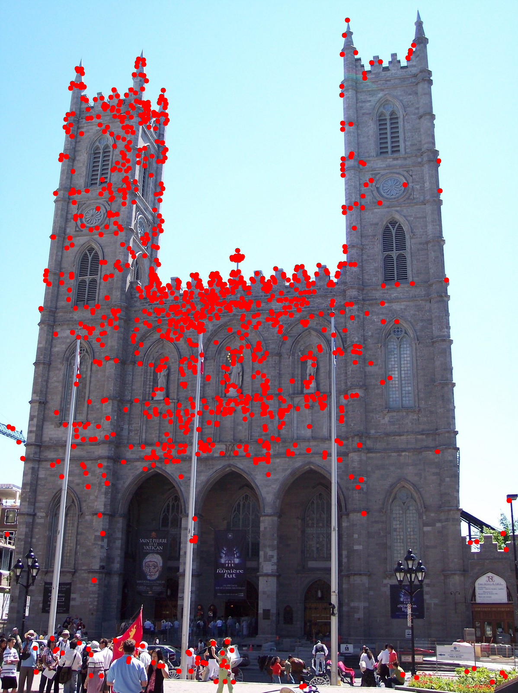

# Improving the matching of deformable objects by learning to detect keypoints
[](LICENSE) [](https://arxiv.org/abs/2309.00434)
[](https://colab.research.google.com/github/verlab/LearningToDetect_PRL_2023/blob/main/notebook/sample.ipynb)

<div align="center">
 
 <br>
</div>

## Table of Contents
- [Improving the matching of deformable objects by learning to detect keypoints](#improving-the-matching-of-deformable-objects-by-learning-to-detect-keypoints)
  - [Table of Contents](#table-of-contents)
  - [Introduction](#introduction)
  - [Requirements](#requirements)
  - [Torch Hub](#torch-hub)
  - [Manual import](#manual-import)
  - [Citation](#citation)
  - [License](#license)
  - [Acknowledgements](#acknowledgements)


## Introduction
This repository contains the official implementation of the paper: *[Improving the matching of deformable objects by learning to detect keypoints](https://arxiv.org/abs/2309.00434)* published in Elsevier's Pattern Recognition Letters 2023.

**Abstract**: We propose a novel learned keypoint detection method to increase the number of correct matches for the task of non-rigid image correspondence. By leveraging true correspondences acquired by matching annotated image pairs with a specified descriptor extractor, we train an end-to-end convolutional neural network (CNN) to find keypoint locations that are more appropriate to the considered descriptor. Experiments demonstrate that our method enhances the Mean Matching Accuracy of numerous descriptors when used in conjunction with our detection method, while outperforming the state-of-the-art keypoint detectors on real images of non-rigid objects by 20 p.p. We also apply our method on the complex real-world task of object retrieval where our detector performs on par with the finest keypoint detectors currently available for this task

## Requirements
[Pytorch (>=1.12.0)](https://pytorch.org/get-started/previous-versions/) is the only dependency for the inferece network. 
For reading and writing images, we use OpenCV. 

First create and activate the enviroment:

```bash
conda create -n prl pip
conda activate prl
```

Now install the dependencies.

```bash
pip install opencv-python

# for GPU 
pip install torch torchvision torchaudio

# for CPU Only 
pip install torch torchvision torchaudio --index-url https://download.pytorch.org/whl/cpu

```

## Torch Hub

For a quick and easy test, try using torch hub! You can find the complete example in [./example_hub.py](./example_hub.py)

```python
import cv2, torch

device = torch.device("cuda" if torch.cuda.is_available() else "cpu")
image = cv2.imread("...")

# get the pretrained model
detector = torch.hub.load("verlab/LearningToDetect_PRL_2023:main", "Detector", pretrained=True)

# move it to the GPU, if available
detector.to(detector)

# detect!
keypoints, score_map = detector.detect(image, 1024)

```

## Manual import
Using this repository you can direcly import the model. You can find the complete example in [./run_detector.py](./run_detector.py)

```python
from models.our_detector import Our

device = torch.device("cuda" if torch.cuda.is_available() else "cpu")
weights_path = "..."
image = cv2.imread("...")

# Intantiate the model 
detector = Our()
detector.load_state_dict(torch.load(weights_path, map_location = device))

# move it to the GPU, if available
detector.to(detector)

# detect!
keypoints, score_map = detector.detect(image, 1024)

```

## Citation
If you find this code useful for your research, please cite the paper:

```bibtex
@article{CADAR2023,
 title = {Improving the matching of deformable objects by learning to detect keypoints},
 journal = {Pattern Recognition Letters},
 year = {2023},
 issn = {0167-8655},
 doi = {https://doi.org/10.1016/j.patrec.2023.08.012},
 url = {https://www.sciencedirect.com/science/article/pii/S0167865523002325},
 author = {Felipe Cadar and Welerson Melo and Vaishnavi Kanagasabapathi and Guilherme Potje and Renato Martins and Erickson R. Nascimento}
}
```

## License
[](LICENSE)

## Acknowledgements
- We would like to thank CAPES, CNPq, FAPEMIG, Google, and Conseil Régional BFC for funding different parts of this work and NVIDIA for the donation of a Titan XP GPU used for this study.
- This work was also granted access to the HPC resources of IDRIS under the project 2021-AD011013154.

**VeRLab:** Laboratory of Computer Vison and Robotics https://www.verlab.dcc.ufmg.br
<br>


<br/>
